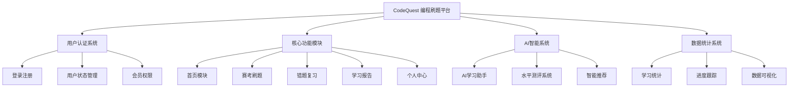
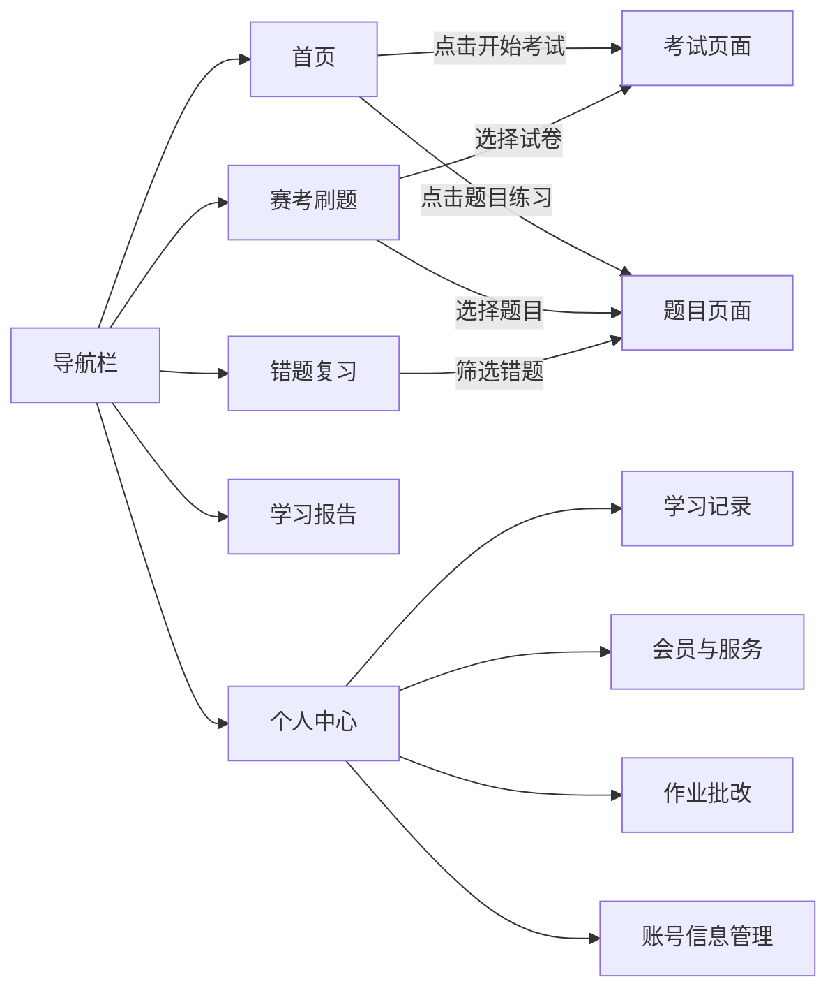
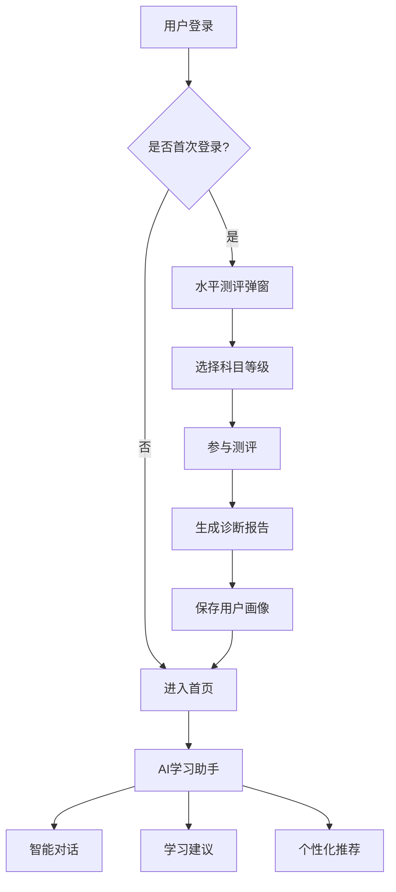
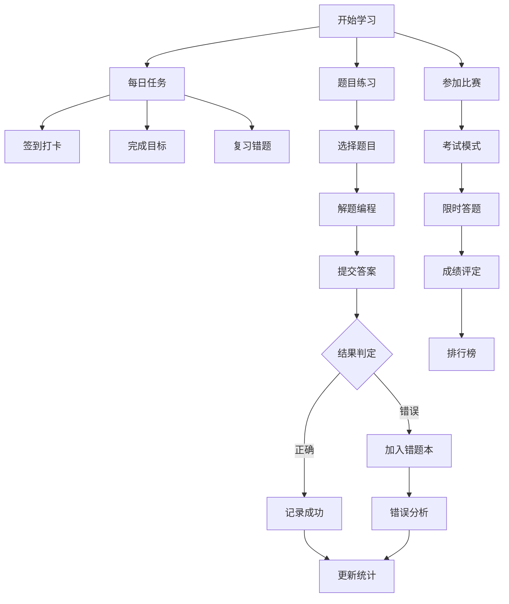
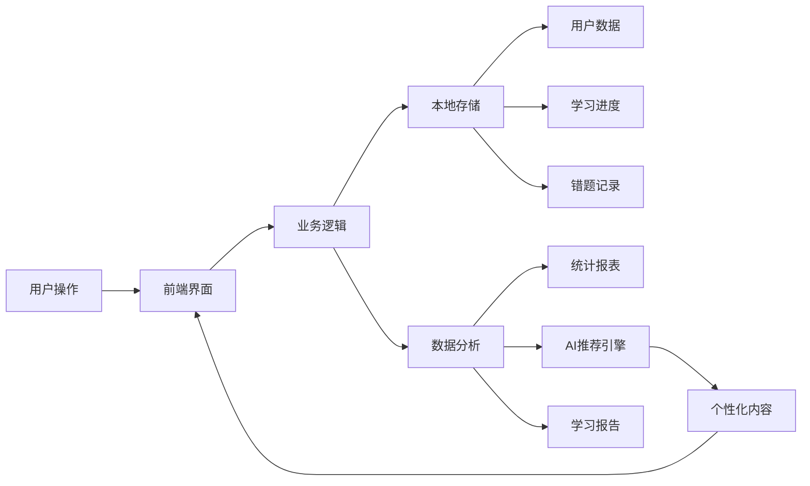

# CodeQuest v2.1 产品功能结构图

## 整体系统架构

```mermaid
graph TB
    A[CodeQuest 编程刷题平台] --> B[用户认证系统]
    A --> C[核心功能模块]
    A --> D[AI智能系统]
    A --> E[数据统计系统]

    B --> B1[登录注册]
    B --> B2[用户状态管理]
    B --> B3[会员权限]

    C --> C1[首页模块]
    C --> C2[赛考刷题]
    C --> C3[错题复习] 
    C --> C4[学习报告]
    C --> C5[个人中心]

    D --> D1[AI学习助手]
    D --> D2[水平测评系统]
    D --> D3[智能推荐]

    E --> E1[学习统计]
    E --> E2[进度跟踪]
    E --> E3[数据可视化]
```

## 页面导航结构

```mermaid
graph LR
    Navigation[导航栏] --> Home[首页]
    Navigation --> Contest[赛考刷题]
    Navigation --> Mistakes[错题复习]
    Navigation --> Profile[学习报告]
    Navigation --> Account[个人中心]

    Home --> |点击开始考试| ExamPage[考试页面]
    Home --> |点击题目练习| ProblemPage[题目页面]
    Contest --> |选择试卷| ExamPage
    Contest --> |选择题目| ProblemPage
    Mistakes --> |筛选错题| ProblemPage
    
    Account --> Account1[学习记录]
    Account --> Account2[会员与服务]
    Account --> Account3[作业批改]
    Account --> Account4[账号信息管理]
```

## AI智能系统流程

```mermaid
graph TD
    Login[用户登录] --> Check{是否首次登录?}
    Check -->|是| Assessment[水平测评弹窗]
    Check -->|否| HomePage[进入首页]
    
    Assessment --> SelectSubject[选择科目等级]
    SelectSubject --> TakeTest[参与测评]
    TakeTest --> Report[生成诊断报告]
    Report --> SaveProfile[保存用户画像]
    SaveProfile --> HomePage
    
    HomePage --> AIAssistant[AI学习助手]
    AIAssistant --> Chat[智能对话]
    AIAssistant --> Tips[学习建议]
    AIAssistant --> Recommendation[个性化推荐]
```

## 学习流程架构

```mermaid
graph TB
    Start[开始学习] --> Daily[每日任务]
    Start --> Practice[题目练习]
    Start --> Contest[参加比赛]
    
    Daily --> Sign[签到打卡]
    Daily --> Goal[完成目标]
    Daily --> Review[复习错题]
    
    Practice --> Choose[选择题目]
    Choose --> Solve[解题编程]
    Solve --> Submit[提交答案]
    Submit --> Result{结果判定}
    
    Result -->|正确| Success[记录成功]
    Result -->|错误| Wrong[加入错题本]
    
    Success --> Stats[更新统计]
    Wrong --> Analyze[错误分析]
    Analyze --> Stats
    
    Contest --> ExamMode[考试模式]
    ExamMode --> Timer[限时答题]
    Timer --> Grade[成绩评定]
    Grade --> Ranking[排行榜]
```

## 数据流向图

```mermaid
graph LR
    User[用户操作] --> Frontend[前端界面]
    Frontend --> Logic[业务逻辑]
    Logic --> Storage[本地存储]
    Logic --> Analytics[数据分析]
    
    Storage --> UserData[用户数据]
    Storage --> Progress[学习进度]
    Storage --> Mistakes[错题记录]
    
    Analytics --> Stats[统计报表]
    Analytics --> AI[AI推荐引擎]
    Analytics --> Reports[学习报告]
    
    AI --> Personalization[个性化内容]
    Personalization --> Frontend
```